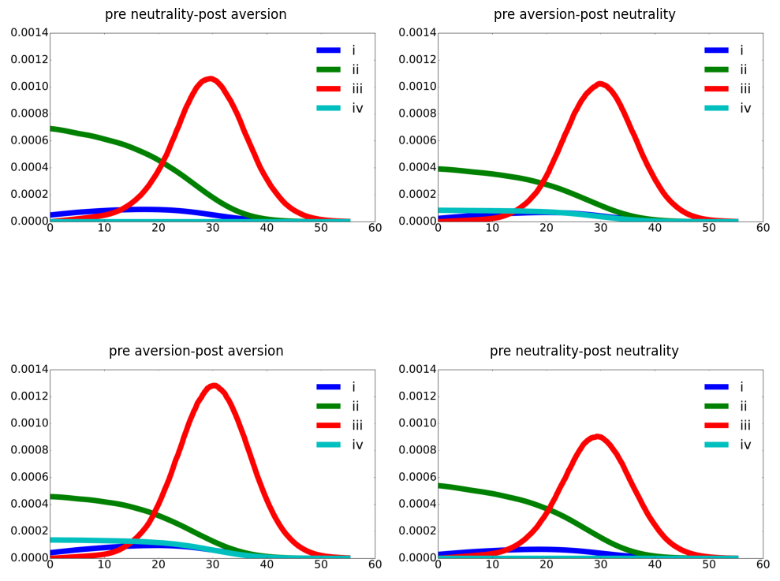

16: Value Decomposition
=======================

16.1 Numerical Method Demonstration
-----------------------------------

As we discussed in section 3, there are two steps to do value
decomposition:

1. Simulate state variable processes and first variation processes.

2. Calculated four terms of discounted social cash flow.

Here we use finite difference method to calculate the derivatives with
respect to state variables and the interpolate to get partial
derivatives at every point. The derivative we need to calculate is
:raw-latex:`\begin{align*}
\{\frac{\partial \mu_i}{\partial x}(x) ,    \frac{\partial \sigma_i}{\partial x}(x) , \frac{\partial V}{\partial x}(x)  ,V^\ell_x(X_t) , U_x(X_t) , {\mathcal J}^{\ell}_x(X_t)      \}
\end{align*}`

.. code:: ipython3

    def simulate_pre(data, Data_Dir, File_Dir):
    
        ...
        '''Finite Differenc Method to calculate derivetives needed in value decomposition'''
        df_U_m1 = finiteDiff_4D(df_U,0,1,wscale)
        df_U_m2 = finiteDiff_4D(df_U,1,1,zscale)
        df_U_m3 = finiteDiff_4D(df_U,2,1,vscale)
        df_U_m4 = finiteDiff_4D(df_U,3,1,xscale)
    
        df_J1_m1 = finiteDiff_4D(J1,0,1,wscale)
        df_J2_m2 = finiteDiff_4D(J2,1,1,zscale)
        df_J3_m3 = finiteDiff_4D(J3,2,1,vscale)
        df_J4_m4 = finiteDiff_4D(J4,3,1,vscale)
     
        df_V1_m1 = finiteDiff_4D(V1,0,1,wscale)
        df_V1_m2 = finiteDiff_4D(V1,1,1,zscale)
        df_V1_m3 = finiteDiff_4D(V1,2,1,vscale)
        df_V1_m4 = finiteDiff_4D(V1,3,1,xscale)
    
    
    
        df_V2_m1 = np.zeros_like(V2)
        df_V2_m2 = np.zeros_like(V2)
        df_V2_m3 = np.zeros_like(V2)
        df_V2_m4 = np.zeros_like(V2)
    
     
        df_f_damage_m1 = np.zeros_like(f_damage)
        df_f_damage_m2 = np.zeros_like(f_damage)
        df_f_damage_m3 = np.zeros_like(f_damage)
        df_f_damage_m4 = np.zeros_like(f_damage)
    
        for i in range(n_damage):
    
            
            df_V2_m1_slice = finiteDiff_4D(V2[i,:,:,:,:],0,1,wscale)
            df_V2_m2_slice = finiteDiff_4D(V2[i,:,:,:,:],1,1,zscale)
            df_V2_m3_slice = finiteDiff_4D(V2[i,:,:,:,:],2,1,vscale)
            df_V2_m4_slice = finiteDiff_4D(V2[i,:,:,:,:],3,1,xscale)
    
            df_V2_m1[i,:,:,:,:] = df_V2_m1_slice
            df_V2_m2[i,:,:,:,:] = df_V2_m2_slice
            df_V2_m3[i,:,:,:,:] = df_V2_m3_slice
            df_V2_m4[i,:,:,:,:] = df_V2_m4_slice
    
    
            
            df_f_damage_m1_slice = finiteDiff_4D(f_damage[i,:,:,:,:],0,1,wscale)
            df_f_damage_m2_slice = finiteDiff_4D(f_damage[i,:,:,:,:],1,1,zscale)
            df_f_damage_m3_slice = finiteDiff_4D(f_damage[i,:,:,:,:],2,1,vscale)
            df_f_damage_m4_slice = finiteDiff_4D(f_damage[i,:,:,:,:],3,1,xscale)
    
            df_f_damage_m1[i,:,:,:,:] = df_f_damage_m1_slice
            df_f_damage_m2[i,:,:,:,:] = df_f_damage_m2_slice
            df_f_damage_m3[i,:,:,:,:] = df_f_damage_m3_slice
            df_f_damage_m4[i,:,:,:,:] = df_f_damage_m4_slice
    
        df_f_tech_m1 = finiteDiff_4D(f_tech,0,1,wscale)
        df_f_tech_m2 = finiteDiff_4D(f_tech,1,1,zscale)
        df_f_tech_m3 = finiteDiff_4D(f_tech,2,1,vscale)
        df_f_tech_m4 = finiteDiff_4D(f_tech,3,1,xscale)
    
    
        df_V3_m1 = finiteDiff_4D(V3,0,1,wscale)
        df_V3_m2 = finiteDiff_4D(V3,1,1,zscale)
        df_V3_m3 = finiteDiff_4D(V3,2,1,vscale)
        df_V3_m4 = finiteDiff_4D(V3,3,1,xscale)
    
        df_V4_m1 = finiteDiff_4D(V4,0,1,wscale)
        df_V4_m2 = finiteDiff_4D(V4,1,1,zscale)
        df_V4_m3 = finiteDiff_4D(V4,2,1,vscale)
        df_V4_m4 = finiteDiff_4D(V4,3,1,xscale)
    
        df_V_m1 = finiteDiff_4D(Va,0,1,wscale)
        df_V_m2 = finiteDiff_4D(Va,1,1,zscale)
        df_V_m3 = finiteDiff_4D(Va,2,1,vscale)
        df_V_m4 = finiteDiff_4D(Va,3,1,xscale)
        df_muW_interpolated = RGI([W_unique,Z_unique, V_unique, X_unique], df_muW_reshaped, fill_value=None, bounds_error=True)
        df_muZ_interpolated = RGI([W_unique,Z_unique, V_unique, X_unique], df_muZ_reshaped, fill_value=None, bounds_error=True)
        df_muV_interpolated = RGI([W_unique,Z_unique, V_unique, X_unique], df_muV_reshaped, fill_value=None, bounds_error=True)
        df_muX_interpolated = RGI([W_unique,Z_unique, V_unique, X_unique], df_muX_reshaped, fill_value=None, bounds_error=True)
    
        df_muW_interpolated_m1 = RGI([W_unique,Z_unique, V_unique, X_unique], df_muW_reshaped_m1, fill_value=None, bounds_error=True)
        df_muW_interpolated_m2 = RGI([W_unique,Z_unique, V_unique, X_unique], df_muW_reshaped_m2, fill_value=None, bounds_error=True)
        df_muW_interpolated_m3 = RGI([W_unique,Z_unique, V_unique, X_unique], df_muW_reshaped_m3, fill_value=None, bounds_error=True)
        df_muW_interpolated_m4 = RGI([W_unique,Z_unique, V_unique, X_unique], df_muW_reshaped_m4, fill_value=None, bounds_error=True)
    
        df_muZ_interpolated_m1 = RGI([W_unique,Z_unique, V_unique, X_unique], df_muZ_reshaped_m1, fill_value=None, bounds_error=True)
        df_muZ_interpolated_m2 = RGI([W_unique,Z_unique, V_unique, X_unique], df_muZ_reshaped_m2, fill_value=None, bounds_error=True)
        df_muZ_interpolated_m3 = RGI([W_unique,Z_unique, V_unique, X_unique], df_muZ_reshaped_m3, fill_value=None, bounds_error=True)
        df_muZ_interpolated_m4 = RGI([W_unique,Z_unique, V_unique, X_unique], df_muZ_reshaped_m4, fill_value=None, bounds_error=True)
    
        df_muV_interpolated_m1 = RGI([W_unique,Z_unique, V_unique, X_unique], df_muV_reshaped_m1, fill_value=None, bounds_error=True)
        df_muV_interpolated_m2 = RGI([W_unique,Z_unique, V_unique, X_unique], df_muV_reshaped_m2, fill_value=None, bounds_error=True)
        df_muV_interpolated_m3 = RGI([W_unique,Z_unique, V_unique, X_unique], df_muV_reshaped_m3, fill_value=None, bounds_error=True)
        df_muV_interpolated_m4 = RGI([W_unique,Z_unique, V_unique, X_unique], df_muV_reshaped_m4, fill_value=None, bounds_error=True)
    
        df_muX_interpolated_m1 = RGI([W_unique,Z_unique, V_unique, X_unique], df_muX_reshaped_m1, fill_value=None, bounds_error=True)
        df_muX_interpolated_m2 = RGI([W_unique,Z_unique, V_unique, X_unique], df_muX_reshaped_m2, fill_value=None, bounds_error=True)
        df_muX_interpolated_m3 = RGI([W_unique,Z_unique, V_unique, X_unique], df_muX_reshaped_m3, fill_value=None, bounds_error=True)
        df_muX_interpolated_m4 = RGI([W_unique,Z_unique, V_unique, X_unique], df_muX_reshaped_m4, fill_value=None, bounds_error=True)
    
        df_sigmaW0_interpolated = RGI([W_unique,Z_unique, V_unique, X_unique], df_sigmaW0_reshaped, fill_value=None, bounds_error=True)
        df_sigmaZ0_interpolated = RGI([W_unique,Z_unique, V_unique, X_unique], df_sigmaZ0_reshaped, fill_value=None, bounds_error=True)
        df_sigmaV0_interpolated = RGI([W_unique,Z_unique, V_unique, X_unique], df_sigmaV0_reshaped, fill_value=None, bounds_error=True)
        df_sigmaX0_interpolated = RGI([W_unique,Z_unique, V_unique, X_unique], df_sigmaX0_reshaped, fill_value=None, bounds_error=True)
    
        df_sigmaW0_interpolated_m1 = RGI([W_unique,Z_unique, V_unique, X_unique], df_sigmaW0_reshaped_m1, fill_value=None, bounds_error=True)
        df_sigmaW0_interpolated_m2 = RGI([W_unique,Z_unique, V_unique, X_unique], df_sigmaW0_reshaped_m2, fill_value=None, bounds_error=True)
        df_sigmaW0_interpolated_m3 = RGI([W_unique,Z_unique, V_unique, X_unique], df_sigmaW0_reshaped_m3, fill_value=None, bounds_error=True)
        df_sigmaW0_interpolated_m4 = RGI([W_unique,Z_unique, V_unique, X_unique], df_sigmaW0_reshaped_m4, fill_value=None, bounds_error=True)
    
        df_sigmaZ0_interpolated_m1 = RGI([W_unique,Z_unique, V_unique, X_unique], df_sigmaZ0_reshaped_m1, fill_value=None, bounds_error=True)
        df_sigmaZ0_interpolated_m2 = RGI([W_unique,Z_unique, V_unique, X_unique], df_sigmaZ0_reshaped_m2, fill_value=None, bounds_error=True)
        df_sigmaZ0_interpolated_m3 = RGI([W_unique,Z_unique, V_unique, X_unique], df_sigmaZ0_reshaped_m3, fill_value=None, bounds_error=True)
        df_sigmaZ0_interpolated_m4 = RGI([W_unique,Z_unique, V_unique, X_unique], df_sigmaZ0_reshaped_m4, fill_value=None, bounds_error=True)
    
        df_sigmaV0_interpolated_m1 = RGI([W_unique,Z_unique, V_unique, X_unique], df_sigmaV0_reshaped_m1, fill_value=None, bounds_error=True)
        df_sigmaV0_interpolated_m2 = RGI([W_unique,Z_unique, V_unique, X_unique], df_sigmaV0_reshaped_m2, fill_value=None, bounds_error=True)
        df_sigmaV0_interpolated_m3 = RGI([W_unique,Z_unique, V_unique, X_unique], df_sigmaV0_reshaped_m3, fill_value=None, bounds_error=True)
        df_sigmaV0_interpolated_m4 = RGI([W_unique,Z_unique, V_unique, X_unique], df_sigmaV0_reshaped_m4, fill_value=None, bounds_error=True)
    
        df_sigmaX0_interpolated_m1 = RGI([W_unique,Z_unique, V_unique, X_unique], df_sigmaX0_reshaped_m1, fill_value=None, bounds_error=True)
        df_sigmaX0_interpolated_m2 = RGI([W_unique,Z_unique, V_unique, X_unique], df_sigmaX0_reshaped_m2, fill_value=None, bounds_error=True)
        df_sigmaX0_interpolated_m3 = RGI([W_unique,Z_unique, V_unique, X_unique], df_sigmaX0_reshaped_m3, fill_value=None, bounds_error=True)
        df_sigmaX0_interpolated_m4 = RGI([W_unique,Z_unique, V_unique, X_unique], df_sigmaX0_reshaped_m4, fill_value=None, bounds_error=True)
    
        df_U_interpolated_m1 = RGI([W_unique,Z_unique, V_unique, X_unique], df_U_m1, fill_value=None, bounds_error=True)
        df_U_interpolated_m2 = RGI([W_unique,Z_unique, V_unique, X_unique], df_U_m2, fill_value=None, bounds_error=True)
        df_U_interpolated_m3 = RGI([W_unique,Z_unique, V_unique, X_unique], df_U_m3, fill_value=None, bounds_error=True)
        df_U_interpolated_m4 = RGI([W_unique,Z_unique, V_unique, X_unique], df_U_m4, fill_value=None, bounds_error=True)
    
     
        df_Entropy_interpolated_m1 = RGI([W_unique,Z_unique, V_unique, X_unique], df_Entropy_dx1, fill_value=None, bounds_error=True)
        df_Entropy_interpolated_m2 = RGI([W_unique,Z_unique, V_unique, X_unique], df_Entropy_dx2, fill_value=None, bounds_error=True)
        df_Entropy_interpolated_m3 = RGI([W_unique,Z_unique, V_unique, X_unique], df_Entropy_dx3, fill_value=None, bounds_error=True)
        df_Entropy_interpolated_m4 = RGI([W_unique,Z_unique, V_unique, X_unique], df_Entropy_dx4, fill_value=None, bounds_error=True)
    
     
        df_J1_interpolated_m1 = RGI([W_unique,Z_unique, V_unique, X_unique], df_J1_m1, fill_value=None, bounds_error=True)
        df_J2_interpolated_m2 = RGI([W_unique,Z_unique, V_unique, X_unique], df_J2_m2, fill_value=None, bounds_error=True)
        df_J3_interpolated_m3 = RGI([W_unique,Z_unique, V_unique, X_unique], df_J3_m3, fill_value=None, bounds_error=True)
        df_J4_interpolated_m4 = RGI([W_unique,Z_unique, V_unique, X_unique], df_J4_m4, fill_value=None, bounds_error=True)
        
        df_V1_interpolated_m1 = RGI([W_unique,Z_unique, V_unique, X_unique], df_V1_m1, fill_value=None, bounds_error=True)
        df_V1_interpolated_m2 = RGI([W_unique,Z_unique, V_unique, X_unique], df_V1_m2, fill_value=None, bounds_error=True)
        df_V1_interpolated_m3 = RGI([W_unique,Z_unique, V_unique, X_unique], df_V1_m3, fill_value=None, bounds_error=True)
        df_V1_interpolated_m4 = RGI([W_unique,Z_unique, V_unique, X_unique], df_V1_m4, fill_value=None, bounds_error=True)

Then we start the for loop from time 0 to recursively get four
discounted term.

.. code:: ipython3

    for t in range(N-1): 
        muW_t = df_muW_interpolated([w_process[t],z_process[t],v_process[t],x_process[t]])
        sigmaW0_t = df_sigmaW0_interpolated([w_process[t],z_process[t],v_process[t],x_process[t]])
        
        muZ_t = df_muZ_interpolated([w_process[t],z_process[t],v_process[t],x_process[t]])
        sigmaZ0_t = df_sigmaZ0_interpolated([w_process[t],z_process[t],v_process[t],x_process[t]])
        
        muV_t = df_muV_interpolated([w_process[t],z_process[t],v_process[t],x_process[t]])
        sigmaV0_t = df_sigmaV0_interpolated([w_process[t],z_process[t],v_process[t],x_process[t]])
    
        muX_t = df_muX_interpolated([w_process[t],z_process[t],v_process[t],x_process[t]])
        sigmaX0_t = df_sigmaX0_interpolated([w_process[t],z_process[t],v_process[t],x_process[t]])
    
        mu_m1_t = m1_process[t]*df_muW_interpolated_m1([w_process[t],z_process[t],v_process[t],x_process[t]])+\
                    m2_process[t]*df_muW_interpolated_m2([w_process[t],z_process[t],v_process[t],x_process[t]])+\
                    m3_process[t]*df_muW_interpolated_m3([w_process[t],z_process[t],v_process[t],x_process[t]])+\
                    m4_process[t]*df_muW_interpolated_m4([w_process[t],z_process[t],v_process[t],x_process[t]])
    
        sigma_m1_t = m1_process[t]*df_sigmaW0_interpolated_m1([w_process[t],z_process[t],v_process[t],x_process[t]])+\
                    m2_process[t]*df_sigmaW0_interpolated_m2([w_process[t],z_process[t],v_process[t],x_process[t]])+\
                    m3_process[t]*df_sigmaW0_interpolated_m3([w_process[t],z_process[t],v_process[t],x_process[t]])+\
                    m4_process[t]*df_sigmaW0_interpolated_m4([w_process[t],z_process[t],v_process[t],x_process[t]])
                    
        mu_m2_t = m1_process[t]*df_muZ_interpolated_m1([w_process[t],z_process[t],v_process[t],x_process[t]])+\
                    m2_process[t]*df_muZ_interpolated_m2([w_process[t],z_process[t],v_process[t],x_process[t]])+\
                    m3_process[t]*df_muZ_interpolated_m3([w_process[t],z_process[t],v_process[t],x_process[t]])+\
                    m4_process[t]*df_muZ_interpolated_m4([w_process[t],z_process[t],v_process[t],x_process[t]])
                    
        sigma_m2_t = m1_process[t]*df_sigmaZ0_interpolated_m1([w_process[t],z_process[t],v_process[t],x_process[t]])+\
                    m2_process[t]*df_sigmaZ0_interpolated_m2([w_process[t],z_process[t],v_process[t],x_process[t]])+\
                    m3_process[t]*df_sigmaZ0_interpolated_m3([w_process[t],z_process[t],v_process[t],x_process[t]])+\
                    m4_process[t]*df_sigmaZ0_interpolated_m4([w_process[t],z_process[t],v_process[t],x_process[t]])
                    
        mu_m3_t = m1_process[t]*df_muV_interpolated_m1([w_process[t],z_process[t],v_process[t],x_process[t]])+\
                    m2_process[t]*df_muV_interpolated_m2([w_process[t],z_process[t],v_process[t],x_process[t]])+\
                    m3_process[t]*df_muV_interpolated_m3([w_process[t],z_process[t],v_process[t],x_process[t]])+\
                    m4_process[t]*df_muV_interpolated_m4([w_process[t],z_process[t],v_process[t],x_process[t]])
    
        sigma_m3_t = m1_process[t]*df_sigmaV0_interpolated_m1([w_process[t],z_process[t],v_process[t],x_process[t]])+\
                    m2_process[t]*df_sigmaV0_interpolated_m2([w_process[t],z_process[t],v_process[t],x_process[t]])+\
                    m3_process[t]*df_sigmaV0_interpolated_m3([w_process[t],z_process[t],v_process[t],x_process[t]])+\
                    m4_process[t]*df_sigmaV0_interpolated_m4([w_process[t],z_process[t],v_process[t],x_process[t]])
        
    
        mu_m4_t = m1_process[t]*df_muX_interpolated_m1([w_process[t],z_process[t],v_process[t],x_process[t]])+\
                    m2_process[t]*df_muX_interpolated_m2([w_process[t],z_process[t],v_process[t],x_process[t]])+\
                    m3_process[t]*df_muX_interpolated_m3([w_process[t],z_process[t],v_process[t],x_process[t]])+\
                    m4_process[t]*df_muX_interpolated_m4([w_process[t],z_process[t],v_process[t],x_process[t]])
    
        sigma_m4_t = m1_process[t]*df_sigmaX0_interpolated_m1([w_process[t],z_process[t],v_process[t],x_process[t]])+\
                    m2_process[t]*df_sigmaX0_interpolated_m2([w_process[t],z_process[t],v_process[t],x_process[t]])+\
                    m3_process[t]*df_sigmaX0_interpolated_m3([w_process[t],z_process[t],v_process[t],x_process[t]])+\
                    m4_process[t]*df_sigmaX0_interpolated_m4([w_process[t],z_process[t],v_process[t],x_process[t]])
        
    
    
        m1_process[t+1] = m1_process[t] + mu_m1_t*dt + W1[t]*sigma_m1_t
        m2_process[t+1] = m2_process[t] + mu_m2_t*dt + W2[t]*sigma_m2_t
        m3_process[t+1] = m3_process[t] + mu_m3_t*dt + W3[t]*sigma_m3_t
        m4_process[t+1] = m4_process[t] + mu_m4_t*dt + W4[t]*sigma_m4_t
                
        w_process[t+1] = w_process[t] + muW_t*dt + W1[t]*sigmaW0_t 
        z_process[t+1] = z_process[t] + muZ_t*dt + W2[t]*sigmaZ0_t
        v_process[t+1] = v_process[t] + muV_t*dt + W3[t]*sigmaV0_t
        x_process[t+1] = x_process[t] + muX_t*dt + W4[t]*sigmaX0_t
    
        u1_process[t+1] = df_U_interpolated_m1([w_process[t+1],z_process[t+1],v_process[t+1],x_process[t+1]])
        u2_process[t+1] = df_U_interpolated_m2([w_process[t+1],z_process[t+1],v_process[t+1],x_process[t+1]])
        u3_process[t+1] = df_U_interpolated_m3([w_process[t+1],z_process[t+1],v_process[t+1],x_process[t+1]])
        u4_process[t+1] = df_U_interpolated_m4([w_process[t+1],z_process[t+1],v_process[t+1],x_process[t+1]])
    
     
        j1_process[t+1] = df_J1_interpolated([w_process[t+1],z_process[t+1],v_process[t+1],x_process[t+1]])
        j2_process[t+1] = df_J2_interpolated([w_process[t+1],z_process[t+1],v_process[t+1],x_process[t+1]])
        j3_process[t+1] = df_J3_interpolated([w_process[t+1],z_process[t+1],v_process[t+1],x_process[t+1]])
        j4_process[t+1] = df_J4_interpolated([w_process[t+1],z_process[t+1],v_process[t+1],x_process[t+1]])
    
    
        v1_process[t+1] = df_V1_interpolated([w_process[t+1],z_process[t+1],v_process[t+1],x_process[t+1]])
    
    
        for i in range(n_damage):
    
            v2_process[i,t+1] = df_V2_interpolated[i]([w_process[t+1],z_process[t+1],v_process[t+1],x_process[t+1]])
            damage_process[i,t+1] = f_damage_interpolated[i]([w_process[t+1],z_process[t+1],v_process[t+1],x_process[t+1]])
    
    
        tech_process[t+1] = f_tech_interpolated([w_process[t+1],z_process[t+1],v_process[t+1],x_process[t+1]])
    
        Entropy_x1_process[t+1] = df_Entropy_interpolated_m1([w_process[t+1],z_process[t+1],v_process[t+1],x_process[t+1]])
        Entropy_x2_process[t+1] = df_Entropy_interpolated_m2([w_process[t+1],z_process[t+1],v_process[t+1],x_process[t+1]])
        Entropy_x3_process[t+1] = df_Entropy_interpolated_m3([w_process[t+1],z_process[t+1],v_process[t+1],x_process[t+1]])
        Entropy_x4_process[t+1] = df_Entropy_interpolated_m4([w_process[t+1],z_process[t+1],v_process[t+1],x_process[t+1]])
    
        # v2_process[t+1] = df_V2_interpolated([w_process[t+1],z_process[t+1],v_process[t+1],x_process[t+1]])
    
        v3_process[t+1] = df_V3_interpolated([w_process[t+1],z_process[t+1],v_process[t+1],x_process[t+1]])
        v4_process[t+1] = df_V4_interpolated([w_process[t+1],z_process[t+1],v_process[t+1],x_process[t+1]])
    
        va_process[t+1] = df_V_interpolated([w_process[t+1],z_process[t+1],v_process[t+1],x_process[t+1]])
    
        dj1_dx1_process[t+1] = df_J1_interpolated_m1([w_process[t+1],z_process[t+1],v_process[t+1],x_process[t+1]])
        dj2_dx2_process[t+1] = df_J2_interpolated_m2([w_process[t+1],z_process[t+1],v_process[t+1],x_process[t+1]])
        dj3_dx3_process[t+1] = df_J3_interpolated_m3([w_process[t+1],z_process[t+1],v_process[t+1],x_process[t+1]])
        dj4_dx4_process[t+1] = df_J4_interpolated_m4([w_process[t+1],z_process[t+1],v_process[t+1],x_process[t+1]])
        
        dv1_dx1_process[t+1] = df_V1_interpolated_m1([w_process[t+1],z_process[t+1],v_process[t+1],x_process[t+1]])
        dv1_dx2_process[t+1] = df_V1_interpolated_m2([w_process[t+1],z_process[t+1],v_process[t+1],x_process[t+1]])
        dv1_dx3_process[t+1] = df_V1_interpolated_m3([w_process[t+1],z_process[t+1],v_process[t+1],x_process[t+1]])
        dv1_dx4_process[t+1] = df_V1_interpolated_m4([w_process[t+1],z_process[t+1],v_process[t+1],x_process[t+1]])
    
    
        for i in range(n_damage):
            dv2_dx1_process[i,t+1] = df_V2_interpolated_m1[i]([w_process[t+1],z_process[t+1],v_process[t+1],x_process[t+1]])
            dv2_dx2_process[i,t+1] = df_V2_interpolated_m2[i]([w_process[t+1],z_process[t+1],v_process[t+1],x_process[t+1]])
            dv2_dx3_process[i,t+1] = df_V2_interpolated_m3[i]([w_process[t+1],z_process[t+1],v_process[t+1],x_process[t+1]])
            dv2_dx4_process[i,t+1] = df_V2_interpolated_m4[i]([w_process[t+1],z_process[t+1],v_process[t+1],x_process[t+1]])
    
    
            dfdamage_dx1_process[i,t+1] = df_f_damage_interpolated_m1[i]([w_process[t+1],z_process[t+1],v_process[t+1],x_process[t+1]])
            dfdamage_dx2_process[i,t+1] = df_f_damage_interpolated_m2[i]([w_process[t+1],z_process[t+1],v_process[t+1],x_process[t+1]])
            dfdamage_dx3_process[i,t+1] = df_f_damage_interpolated_m3[i]([w_process[t+1],z_process[t+1],v_process[t+1],x_process[t+1]])
            dfdamage_dx4_process[i,t+1] = df_f_damage_interpolated_m4[i]([w_process[t+1],z_process[t+1],v_process[t+1],x_process[t+1]])
    
        dftech_dx1_process[t+1] = df_f_tech_m1_interpolated([w_process[t+1],z_process[t+1],v_process[t+1],x_process[t+1]])
        dftech_dx2_process[t+1] = df_f_tech_m2_interpolated([w_process[t+1],z_process[t+1],v_process[t+1],x_process[t+1]])
        dftech_dx3_process[t+1] = df_f_tech_m3_interpolated([w_process[t+1],z_process[t+1],v_process[t+1],x_process[t+1]])
        dftech_dx4_process[t+1] = df_f_tech_m4_interpolated([w_process[t+1],z_process[t+1],v_process[t+1],x_process[t+1]])
    
     
    
        dv3_dx1_process[t+1] = df_V3_interpolated_m1([w_process[t+1],z_process[t+1],v_process[t+1],x_process[t+1]])
        dv3_dx2_process[t+1] = df_V3_interpolated_m2([w_process[t+1],z_process[t+1],v_process[t+1],x_process[t+1]])
        dv3_dx3_process[t+1] = df_V3_interpolated_m3([w_process[t+1],z_process[t+1],v_process[t+1],x_process[t+1]])
        dv3_dx4_process[t+1] = df_V3_interpolated_m4([w_process[t+1],z_process[t+1],v_process[t+1],x_process[t+1]])
        
        dv4_dx1_process[t+1] = df_V4_interpolated_m1([w_process[t+1],z_process[t+1],v_process[t+1],x_process[t+1]])
        dv4_dx2_process[t+1] = df_V4_interpolated_m2([w_process[t+1],z_process[t+1],v_process[t+1],x_process[t+1]])
        dv4_dx3_process[t+1] = df_V4_interpolated_m3([w_process[t+1],z_process[t+1],v_process[t+1],x_process[t+1]])
        dv4_dx4_process[t+1] = df_V4_interpolated_m4([w_process[t+1],z_process[t+1],v_process[t+1],x_process[t+1]])
        
        dv_dx1_process[t+1] = df_V_interpolated_m1([w_process[t+1],z_process[t+1],v_process[t+1],x_process[t+1]])
        dv_dx2_process[t+1] = df_V_interpolated_m2([w_process[t+1],z_process[t+1],v_process[t+1],x_process[t+1]])
        dv_dx3_process[t+1] = df_V_interpolated_m3([w_process[t+1],z_process[t+1],v_process[t+1],x_process[t+1]])
        dv_dx4_process[t+1] = df_V_interpolated_m4([w_process[t+1],z_process[t+1],v_process[t+1],x_process[t+1]])
    
    
    
        first_term[t+1] = u1_process[t+1]*m1_process[t+1]+\
                        u2_process[t+1]*m2_process[t+1]+\
                        u3_process[t+1]*m3_process[t+1]+\
                        u4_process[t+1]*m4_process[t+1]
     
        second_term[t+1] = dj1_dx1_process[t+1]*(v1_process[t+1] - va_process[t+1])*m1_process[t+1]+\
                    dj2_dx2_process[t+1]*np.mean(damage_process[:,t+1]*(v2_process[:,t+1] - va_process[t+1]),axis=0)*m2_process[t+1]+\
                    dj3_dx3_process[t+1]*tech_process[t+1]*(v3_process[t+1] - va_process[t+1])*m3_process[t+1]+\
                    dj4_dx4_process[t+1]*(v4_process[t+1] - va_process[t+1])*m4_process[t+1]
        third_term_1[t+1] = j1_process[t+1]*(dv1_dx1_process[t+1])*m1_process[t+1]+\
                        j1_process[t+1]*(dv1_dx2_process[t+1])*m2_process[t+1]+\
                        j1_process[t+1]*(dv1_dx3_process[t+1])*m3_process[t+1]+\
                        j1_process[t+1]*(dv1_dx4_process[t+1])*m4_process[t+1]
     
        third_term_2[t+1] = j2_process[t+1]*np.mean(damage_process[:,t+1]*dv2_dx1_process[:,t+1],axis=0)*m1_process[t+1]+\
                        j2_process[t+1]*np.mean(damage_process[:,t+1]*dv2_dx2_process[:,t+1],axis=0)*m2_process[t+1]+\
                        j2_process[t+1]*np.mean(damage_process[:,t+1]*dv2_dx3_process[:,t+1],axis=0)*m3_process[t+1]+\
                        j2_process[t+1]*np.mean(damage_process[:,t+1]*dv2_dx4_process[:,t+1],axis=0)*m4_process[t+1]
     
        third_term_3[t+1] = j3_process[t+1]*tech_process[t+1]*(dv3_dx1_process[t+1])*m1_process[t+1]+\
                        j3_process[t+1]*tech_process[t+1]*(dv3_dx2_process[t+1])*m2_process[t+1]+\
                        j3_process[t+1]*tech_process[t+1]*(dv3_dx3_process[t+1])*m3_process[t+1]+\
                        j3_process[t+1]*tech_process[t+1]*(dv3_dx4_process[t+1])*m4_process[t+1]
    
        third_term_4[t+1] = j4_process[t+1]*(dv4_dx1_process[t+1])*m1_process[t+1]+\
                        j4_process[t+1]*(dv4_dx2_process[t+1])*m2_process[t+1]+\
                        j4_process[t+1]*(dv4_dx3_process[t+1])*m3_process[t+1]+\
                        j4_process[t+1]*(dv4_dx4_process[t+1])*m4_process[t+1]
        
     
        fourth_term_entropy[t+1] = Entropy_x1_process[t+1]*m1_process[t+1]+\
                                    Entropy_x2_process[t+1]*m2_process[t+1]+\
                                    Entropy_x3_process[t+1]*m3_process[t+1]+\
                                    Entropy_x4_process[t+1]*m4_process[t+1]
     
        discount_factor_temps[t+1] =  -delta-j1_process[t+1]-j2_process[t+1]*np.mean(damage_process[:,t+1],axis=0)-j3_process[t+1]*tech_process[t+1]-j4_process[t+1]
        discount_factor_temps_nodelta[t+1] =  -j1_process[t+1]-j2_process[t+1]*np.mean(damage_process[:,t+1],axis=0)-j3_process[t+1]*tech_process[t+1]-j4_process[t+1]
    
        discount_factors[t+1] = discount_factors[t]+discount_factor_temps[t+1]*dt
    
        discount_factor_nodelta_DisSep_Damage[t+1] = discount_factor_nodelta_DisSep_Damage[t]+(-j2_process[t+1]*np.mean(damage_process[:,t+1],axis=0))*dt
        discount_factor_nodelta_DisSep_Tech[t+1] = discount_factor_nodelta_DisSep_Tech[t]+(-j3_process[t+1]*tech_process[t+1])*dt
        discount_factor_nodelta[t+1] = discount_factor_nodelta[t]+discount_factor_temps_nodelta[t+1]*dt
        
        discount_factor_nodeltadt_DisSep_Damage[t+1] = -np.exp(discount_factor_nodelta[t+1]) * ( - j2_process[t+1]*np.mean(damage_process[:,t+1],axis=0)) 
        discount_factor_nodeltadt_DisSep_Tech[t+1] = -np.exp(discount_factor_nodelta[t+1]) * (  - j3_process[t+1]*tech_process[t+1]) 
        discount_factor_nodeltadt[t+1] = -np.exp(discount_factor_nodelta[t+1]) * discount_factor_temps_nodelta[t+1]
        undiscount_process[t+1] = delta*first_term[t+1]+second_term[t+1]+third_term_1[t+1]+third_term_2[t+1]+third_term_3[t+1]+third_term_4[t+1]+fourth_term_entropy[t+1]
     
        discount_process[t+1] = undiscount_process[t+1] * np.exp(discount_factors[t+1])
     
        time_process[t+1] = time_process[t]+dt

We primarily use above code to get the value decomposition results. In
each iteraton step, we store calculate every term used in value
decomposition. Alternative way is to get the entire simulated state
variable and first variational path and then calculate remaining terms.
We can use our generalized code for state varibable and impulse response
simulation.

Once we have the partial derivatives, we can use general code showed
below to parrellelize simulation and calculate the four terms of
discounted social cashflow. In our case, we don’t have jumps, just use
None for L_matrix.

+------------+---------------------------------------------------------+
| **         | **Description**                                         |
| Variable** |                                                         |
+============+=========================================================+
| ``         | ``np.array`` of shape ``(sim_num, sim_time, 2)``.       |
| X_matrix`` | Stores the state variable ( X_t ) for each simulation   |
|            | run and time step. Each entry is an ``np.array``        |
|            | representing ( X_t ).                                   |
+------------+---------------------------------------------------------+
| ``         | ``np.array`` of shape ``(sim_num, sim_time, 2)``.       |
| M_matrix`` | Stores the perturbation direction ( M_t ) for each      |
|            | simulation run and time step. Each entry is an          |
|            | ``np.array`` representing ( M_t ).                      |
+------------+---------------------------------------------------------+
| ``         | ``np.array`` of shape ``(sim_num, sim_time)``. Stores   |
| L_matrix`` | the jump state ( L_t ) (as an integer) for each         |
|            | simulation run and time step.                           |
+------------+---------------------------------------------------------+
| ``U``      | Value function of the state variable and hidden state ( |
|            | (X, L) ).                                               |
+------------+---------------------------------------------------------+
| ``V``      | Value function of the state variable and hidden state ( |
|            | (X, L) ).                                               |
+------------+---------------------------------------------------------+
| ``U_x``    | Derivative of ( U ).                                    |
+------------+---------------------------------------------------------+
| ``V_x``    | Derivative of ( V ).                                    |
+------------+---------------------------------------------------------+
| `          | Function of state variable and hidden state ( (X, L) ). |
| `delta_V`` |                                                         |
+------------+---------------------------------------------------------+
| `          | Function of state variable and hidden state ( (X, L) ). |
| `delta_U`` |                                                         |
+------------+---------------------------------------------------------+
| ``drift_r  | Derivative of ``drift_rest``, function of state         |
| est_diff`` | variable and hidden state ( (X, L) ).                   |
+------------+---------------------------------------------------------+
| ``si       | Integer representing the number of time steps in the    |
| m_length`` | simulation.                                             |
+------------+---------------------------------------------------------+
| ``t        | Float representing the length of each time step.        |
| ime_step`` |                                                         |
+------------+---------------------------------------------------------+

.. code:: ipython3

    def compose_irf(X_matrix, M_matrix, L_matrix, U_x, V_x, delta_V, delta_U, drift_rest_diff, sim_length, time_step): 
        #########################################################################
        # Use simulated state evolution and compose IRF 
        #########################################################################
    
        #########################################################################
        # X_matrix    - np.array of shape (sim_num, sim_time, 2). Stores the state 
        #               variable X_t for each simulation run and time step. Each 
        #               entry is an np.array representing X_t.
        # M_matrix    - np.array of shape (sim_num, sim_time, 2). Stores the 
        #               perturbation direction M_t for each simulation run and 
        #               time step. Each entry is an np.array representing M_t.
        # L_matrix    - np.array of shape (sim_num, sim_time). Stores the jump 
        #               state L_t (as an integer) for each simulation run and time step.
        # U: value function of state variable and hidden state (X, L) 
        # V: value function of state variable and hidden state (X, L) 
        # U_x: derivative of U 
        # V_x: derivative of V 
        # delta_V: function of state variable and hidden state (X, L)
        # delta_U: function of state variable and hidden state (X, L)
        # drift_rest_diff: derivative of drift_rest, function of state variable and hidden state (X, L)
        # sim_length - integer: number of time steps in simulation 
        # time_step - float: length of time step 
    
    
        discount_V = np.zeros(np.shape(L_matrix)) 
        discount_U = np.zeros(np.shape(L_matrix)) 
        drift_rest_diff_series = np.zeros(np.shape(X_matrix)) 
        Ux_series = np.zeros(np.shape(X_matrix)) 
        Vx_series = np.zeros(np.shape(X_matrix)) 
        discount_V_t = [0 for i in range(len(L_matrix))] 
    
        dt = time_step 
    
    
    
    
        
        with ProcessPoolExecutor() as executor:
            futures = {executor.submit(compute_time_step, t, delta_V, delta_U, X_matrix, L_matrix, drift_rest_diff, U_x, V_x): t for t in range(sim_length)}
            results = []
            for future in tqdm(as_completed(futures), total=sim_length, desc="Processing tasks"): 
                try:
                    result = future.result()  # Get the result from the future
                    results.append(result)
                except Exception as e:
                    print(f"Error processing time step {futures[future]}: {e}")
                    continue
    
        # Sort results by time step to ensure correct order
        results.sort(key=lambda x: x[0]) 
    
        for t, discount_V_increment, discount_U_increment, drift_rest_diff_t, U_xt, V_xt in results:
            discount_V_t += discount_V_increment * dt 
            discount_U_t = discount_U_increment
            drift_rest_diff_series_t = drift_rest_diff_t
            discount_V[:, t] = np.exp(discount_V_t) 
            discount_U[:, t] = discount_U_t 
            drift_rest_diff_series[:, t] = drift_rest_diff_series_t
            Ux_series[:, t] = U_xt  
            Vx_series[:, t] = V_xt  
        
        # Compute rhs and drhs across all simulations and time points
        rhs = (discount_V * (np.sum(drift_rest_diff_series * Vx_series * M_matrix, axis = 2) * dt + discount_U * np.sum(Ux_series * M_matrix, axis = 2) * dt
                            )).sum(axis=1) 
        drhs = (discount_V * (np.sum(drift_rest_diff_series * Vx_series * M_matrix, axis = 2) * dt + discount_U * np.sum(Ux_series * M_matrix, axis = 2) * dt
                            ))
        
        # Append or sum for initial values and aggregated results
        sdf1 = discount_V * discount_U * Ux_series[:, :, 0] 
        
        # Compute means
        mean_drhs = np.mean(drhs, axis=0)
        mean_sdf1 = np.mean(sdf1, axis=0)
        mean_return1 = np.mean(M_matrix, axis=0)
    
    
    
        return rhs, mean_drhs, mean_sdf1, mean_return1 
    
    
    def compute_time_step(t, delta_V, delta_U, X_matrix, L_matrix, drift_rest_diff, U_x, V_x): 
        discount_V_increment = np.array([delta_V(X_matrix[i][t], L_matrix[i][t]) for i in range(len(L_matrix))]) 
        discount_U_increment = np.array([delta_U(X_matrix[i][t], L_matrix[i][t]) for i in range(len(L_matrix))]) 
        drift_rest_diff_t = np.array([drift_rest_diff(X_matrix[i][t], L_matrix[i][t]) for i in range(len(L_matrix))]) 
        U_xt = np.array([U_x(X_matrix[i][t], L_matrix[i][t]) for i in range(len(L_matrix))])  
        V_xt = np.array([V_x(X_matrix[i][t], L_matrix[i][t]) for i in range(len(L_matrix))])  
    
        return t, discount_V_increment, discount_U_increment, drift_rest_diff_t, U_xt, V_xt  # Return a tuple directly

Below code uses the law of motion of state variables to simulate the
evolution of state variables and their response to an initial
perturbation in one state using different random seeds.

Input
~~~~~

+--------+-------------------------------------------------------------+
| **Vari | **Description**                                             |
| able** |                                                             |
+========+=============================================================+
| `      | Function: Law of motion for ( X_t ) and ( M_t ). The next   |
| `lom`` | states, ( X\_{t+1} ) and ( M\_{t+1} ), are determined by    |
|        | ``lom(X_t, M_t, W_t, L_t)``.                                |
+--------+-------------------------------------------------------------+
| `      | Function: Drift distortion function. Determines the drift   |
| `drift | term ( :raw-latex:`\mu`\_t ), given by                      |
| _adj`` | ``drift_adj(X_t, L_t)``.                                    |
+--------+-------------------------------------------------------------+
| ``P_t  | Function: Transition probability for ( L_t ). The           |
| rans`` | transition probability ( P ) is given by                    |
|        | ``P_trans(X_t, W_t)``.                                      |
+--------+-------------------------------------------------------------+
| ``X0`` | ``np.array``: Initial state of the state variable ( X_t ).  |
+--------+-------------------------------------------------------------+
| ``M0`` | ``np.array``: Initial perturbation direction vector.        |
+--------+-------------------------------------------------------------+
| ``L0`` | Integer: Initial state of the jump variable ( L_t ).        |
+--------+-------------------------------------------------------------+
| `      | Integer: Dimension of the shock variable ( W_t ).           |
| `num_s |                                                             |
| hock`` |                                                             |
+--------+-------------------------------------------------------------+
| ``sim_ | Float: Total time span of the simulation.                   |
| time`` |                                                             |
+--------+-------------------------------------------------------------+
| ``sim  | Integer: Number of simulation runs to perform.              |
| _num`` |                                                             |
+--------+-------------------------------------------------------------+
| `      | Float: Time step size used for approximating the            |
| `time_ | continuous-time model.                                      |
| step`` |                                                             |
+--------+-------------------------------------------------------------+

Output
~~~~~~

+--------+-------------------------------------------------------------+
| **Vari | **Description**                                             |
| able** |                                                             |
+========+=============================================================+
| ``X_ma | ``np.array`` of shape ``(sim_num, sim_time, 2)``. Stores    |
| trix`` | the state variable ( X_t ) for each simulation run and time |
|        | step. Each entry is an ``np.array`` representing ( X_t ).   |
+--------+-------------------------------------------------------------+
| ``M_ma | ``np.array`` of shape ``(sim_num, sim_time, 2)``. Stores    |
| trix`` | the perturbation direction ( M_t ) for each simulation run  |
|        | and time step. Each entry is an ``np.array`` representing ( |
|        | M_t ).                                                      |
+--------+-------------------------------------------------------------+
| ``L_ma | ``np.array`` of shape ``(sim_num, sim_time)``. Stores the   |
| trix`` | jump state ( L_t ) (as an integer) for each simulation run  |
|        | and time step.                                              |
+--------+-------------------------------------------------------------+

.. code:: ipython3

    def pool_simulation(lom, drift_adj, P_trans, X0, M0, L0, num_shock, sim_time, sim_num, time_step): 
    
        #########################################################################
        # This code uses law of motion of state variables to simulate evolutions of state variables and response to an initial purturbation to one state using different random seeds. 
        #########################################################################
        
        #########################################################################
        # Input variables: 
        #
        # lom         - function: Law of motion for X_t and M_t. The next states, 
        #               X_{t+1} and M_{t+1}, are determined by lom(X_t, M_t, W_t, L_t).
        # drift_adj   - function: Drift distortion function. Determines the drift term, 
        #               mu_t = drift_adj(X_t, L_t).
        # P_trans     - function: Transition probability for L_t. The transition 
        #               probability P is given by P_trans(X_t, W_t).
        # X0          - np.array: Initial state of the state variable X_t.
        # M0          - np.array: Initial perturbation direction vector.
        # L0          - integer: Initial state of the jump variable L_t.
        # num_shock   - integer: Dimension of the shock variable W_t.
        # sim_time    - float: Total time span of the simulation.
        # sim_num     - integer: Number of simulation runs to perform.
        # time_step   - float: Time step size used for approximating the continuous-time model.
        ######################################################################### 
        
        #########################################################################
        # Output variables: 
        # X_matrix    - np.array of shape (sim_num, sim_time, 2). Stores the state 
        #               variable X_t for each simulation run and time step. Each 
        #               entry is an np.array representing X_t.
        # M_matrix    - np.array of shape (sim_num, sim_time, 2). Stores the 
        #               perturbation direction M_t for each simulation run and 
        #               time step. Each entry is an np.array representing M_t.
        # L_matrix    - np.array of shape (sim_num, sim_time). Stores the jump 
        #               state L_t (as an integer) for each simulation run and time step.
        #########################################################################
    
    
        with ProcessPoolExecutor() as executor:
            futures = [executor.submit(simulate_single_process, n, lom, drift_adj, P_trans, X0, M0, L0, num_shock, sim_time, time_step) for n in tqdm(range(sim_num), desc="Submitting tasks")]
            results = []
            success_count = 0 
            fail_count_z = 0 
            for future in tqdm(as_completed(futures), total=sim_num, desc="Processing tasks"): 
                result = future.result() 
                results.extend(result)
    
    
            if not results:
                return None, None
    
            X_matrix, M_matrix, L_matrix = zip(*results) 
    
            return X_matrix, M_matrix, L_matrix 

16.2 Value Decomposition
------------------------

We interpret the partial derivative of the value function with respect
to the R&D knowledge state as an asset price. As such, it has four
payoff contributions as we have derived previously:

1. :math:`\delta m \cdot \frac{\partial U}{\partial x}`;
2. :math:`m \cdot \sum_{\ell=1}^L \frac{\partial {\mathcal J}^\ell}{\partial x} g^{\ell*} (V^\ell - V)`;
3. :math:`m \cdot \sum_{\ell=1}^L {\mathcal J}^\ell g^{\ell*} \frac{\partial V^\ell}{\partial x}`;
4. :math:`\xi m \cdot \sum_{\ell=1}^L \frac{\partial {\mathcal J}^\ell}{\partial x} (1 - g^{\ell*} + g^{\ell*} \log g^{\ell*})`.

We also consider four different configurations of uncertainty aversion
as a way to assess the different economic forces in play:

1. pre-jump neutrality - post-jump neutrality;
2. pre-jump neutrality - post-jump aversion;
3. pre-jump aversion - post-jump neutrality;
4. pre-jump aversion - post-jump aversion.

We include cases b) and c) because they provide revealing intermediate
cases that help understand the overall uncertainty implications. For
instance, there are two forces in play. First, uncertainty about when
the new technology will be realized would seem to make investment in R&D
less attractive. Second, the positive implications for a technological
success can be stronger when there is more aversion to this uncertainty.
Intermediate case c) allows us to feature more the first force, while
intermediate case b) shifts attention to the second force. With these
intermediate cases, we can better assess the quantitative magnitude of
these offsetting forces.

R&D technology discovery channel with :math:`\xi = 0.15`
~~~~~~~~~~~~~~~~~~~~~~~~~~~~~~~~~~~~~~~~~~~~~~~~~~~~~~~~

+-------------------------+----+----+-------+-------+-----+-------+
| Case                    | i  | ii | ii    | ii    | iv  | sum   |
|                         |    |    | i(dc) | i(td) |     |       |
+=========================+====+====+=======+=======+=====+=======+
| pre neutrality          |    |    |       |       |     |       |
+-------------------------+----+----+-------+-------+-----+-------+
| a) post neutrality      | 0  | 0  | 0.    | 0.    | 0   | 0.    |
|                         | .0 | .0 | 01356 | 00173 | .00 | 03003 |
|                         | 01 | 12 |       |       | 000 |       |
|                         | 86 | 87 |       |       |     |       |
+-------------------------+----+----+-------+-------+-----+-------+
| b) post aversion        | 0  | 0  | 0.    | 0.    | 0   | 0.    |
|                         | .0 | .0 | 01570 | 00264 | .00 | 03705 |
|                         | 02 | 16 |       |       | 000 |       |
|                         | 61 | 10 |       |       |     |       |
+-------------------------+----+----+-------+-------+-----+-------+
| pre aversion            |    |    |       |       |     |       |
+-------------------------+----+----+-------+-------+-----+-------+
| c) post neutrality      | 0  | 0  | 0.    | 0.    | 0   | 0.    |
|                         | .0 | .0 | 01598 | 00124 | .00 | 03113 |
|                         | 01 | 09 |       |       | 241 |       |
|                         | 90 | 60 |       |       |     |       |
+-------------------------+----+----+-------+-------+-----+-------+
| d) post aversion        | 0  | 0  | 0.    | 0.    | 0   | 0.    |
|                         | .0 | .0 | 01999 | 00177 | .00 | 03962 |
|                         | 02 | 11 |       |       | 387 |       |
|                         | 72 | 04 |       |       |     |       |
+-------------------------+----+----+-------+-------+-----+-------+

R&D technology discovery channel with :math:`\xi = 0.075`
~~~~~~~~~~~~~~~~~~~~~~~~~~~~~~~~~~~~~~~~~~~~~~~~~~~~~~~~~

+---------------+-------+--------+--------+--------+--------+--------+
|               | i     | ii     | i      | i      | iv     | sum    |
|               |       |        | ii(dc) | ii(td) |        |        |
+===============+=======+========+========+========+========+========+
| **pre         |       |        |        |        |        |        |
| neutrality**  |       |        |        |        |        |        |
+---------------+-------+--------+--------+--------+--------+--------+
| a) post       | 0     | 0.012  | 0.013  | 0.001  | 0.000  | 0.     |
| neutrality    | .0018 | 873257 | 560828 | 734671 | 000004 | 030026 |
|               | 57218 |        |        |        |        |        |
+---------------+-------+--------+--------+--------+--------+--------+
| b) post       | 0     | 0.020  | 0.017  | 0.003  | 0.000  | 0.     |
| aversion      | .0035 | 756782 | 129194 | 902445 | 000012 | 045307 |
|               | 18361 |        |        |        |        |        |
+---------------+-------+--------+--------+--------+--------+--------+
| **pre         |       |        |        |        |        |        |
| aversion**    |       |        |        |        |        |        |
+---------------+-------+--------+--------+--------+--------+--------+
| c) post       | 0     | 0.006  | 0.018  | 0.000  | 0.004  | 0.     |
| neutrality    | .0019 | 724568 | 433624 | 809961 | 229411 | 032099 |
|               | 01772 |        |        |        |        |        |
+---------------+-------+--------+--------+--------+--------+--------+
| d) post       | 0     | 0.006  | 0.029  | 0.001  | 0.010  | 0.     |
| aversion      | .0033 | 335223 | 402412 | 150690 | 221146 | 050493 |
|               | 83954 |        |        |        |        |        |
+---------------+-------+--------+--------+--------+--------+--------+

### R&D technology discovery channel with :math:`\xi = 0.005`

+---------------+-------+--------+--------+--------+--------+--------+
|               | i     | ii     | i      | i      | iv     | sum    |
|               |       |        | ii(dc) | ii(td) |        |        |
+===============+=======+========+========+========+========+========+
| **pre         |       |        |        |        |        |        |
| neutrality**  |       |        |        |        |        |        |
+---------------+-------+--------+--------+--------+--------+--------+
| post          | 0     | 0.012  | 0.013  | 0.001  | 0.000  | 0.     |
| neutrality    | .0018 | 873257 | 560828 | 734671 | 000004 | 030026 |
|               | 57218 |        |        |        |        |        |
+---------------+-------+--------+--------+--------+--------+--------+
| post aversion | 0     | 0.071  | 0.001  | 0.022  | 0.000  | 0.     |
|               | .0096 | 895016 | 216563 | 364848 | 000171 | 105103 |
|               | 26521 |        |        |        |        |        |
+---------------+-------+--------+--------+--------+--------+--------+
| **pre         |       |        |        |        |        |        |
| aversion**    |       |        |        |        |        |        |
+---------------+-------+--------+--------+--------+--------+--------+
| post          | 0     | -0.000 | 0.023  | 0.000  | 0.001  | 0.     |
| neutrality    | .0013 | 342846 | 794618 | 000000 | 459983 | 026249 |
|               | 38064 |        |        |        |        |        |
+---------------+-------+--------+--------+--------+--------+--------+
| post aversion | -0    | -0.000 | 0.010  | 0.000  | 0.002  | 0.     |
|               | .0012 | 179618 | 892420 | 000000 | 009618 | 011436 |
|               | 85934 |        |        |        |        |        |
+---------------+-------+--------+--------+--------+--------+--------+

All four channels are activated with :math:`\xi = 0.15`
~~~~~~~~~~~~~~~~~~~~~~~~~~~~~~~~~~~~~~~~~~~~~~~~~~~~~~~

+---------------+-------+--------+--------+--------+--------+--------+
|               | i     | ii     | i      | i      | iv     | sum    |
|               |       |        | ii(dc) | ii(td) |        |        |
+===============+=======+========+========+========+========+========+
| **pre         |       |        |        |        |        |        |
| neutrality**  |       |        |        |        |        |        |
+---------------+-------+--------+--------+--------+--------+--------+
| a) post       | 0     | 0.012  | 0.013  | 0.001  | 0.000  | 0.     |
| neutrality    | .0018 | 873257 | 560828 | 734671 | 000004 | 030026 |
|               | 57218 |        |        |        |        |        |
+---------------+-------+--------+--------+--------+--------+--------+
| b) post       | 0     | 0.015  | 0.015  | 0.002  | 0.000  | 0.     |
| aversion      | .0025 | 145588 | 750393 | 774305 | 000007 | 036260 |
|               | 89657 |        |        |        |        |        |
+---------------+-------+--------+--------+--------+--------+--------+
| **pre         |       |        |        |        |        |        |
| aversion**    |       |        |        |        |        |        |
+---------------+-------+--------+--------+--------+--------+--------+
| c) post       | 0     | 0.009  | 0.016  | 0.001  | 0.002  | 0.     |
| neutrality    | .0020 | 885185 | 963779 | 264800 | 905626 | 033076 |
|               | 56726 |        |        |        |        |        |
+---------------+-------+--------+--------+--------+--------+--------+
| d) post       | 0     | 0.010  | 0.021  | 0.002  | 0.004  | 0.     |
| aversion      | .0030 | 126330 | 902142 | 065545 | 583659 | 041731 |
|               | 53070 |        |        |        |        |        |
+---------------+-------+--------+--------+--------+--------+--------+

16.2 Expected Marginal Social Payoffs for Alternative Horizons
--------------------------------------------------------------

As we demonstrated, the derivative of the value function has the
interpretation as a stochastically discounted social cash flow, with the
four contributions given at the outset of Section 3.3. The “stochastic
discount factor” includes the vector of stochastic impulse responses,
the process :math:`M`, along with the subjective rate of discount,
:math:`\delta`. The following figure shows the period-by-period
contribution for each of the four components.

Horizon decomposition of social cash flow contributions to the R&D stock
valuation. The four panels correspond to different uncertainty aversion
configurations: Panel A is the pre neutrality-post aversion
configuration; Panel B is the pre aversion-post neutrality
configuration; Panel C is the pre aversion-post aversion configuration;
and Panel D is the pre neutrality-post neutrality configuration. The
blue lines correspond to the payoff contribution i)
:math:`\delta m \cdot \frac{\partial U}{\partial r}`. The green lines
correspond to the payoff contribution ii)
:math:`m \cdot \sum_\ell g^{\ell*}\frac{\partial {\mathcal J}^\ell}{\partial r} (V^\ell - V)`.
The red lines correspond to the payoff contribution iii) $m
:raw-latex:`\cdot `:raw-latex:`\sum`\_:raw-latex:`\ell `g\ :sup:`{:raw-latex:`\ell*`}{:raw-latex:`\mathcal `J}`\ :raw-latex:`\ell `:raw-latex:`\frac {\partial V^\ell}{\partial r}`
$. The light blue lines correspond to the payoff contribution iv)
:math:`\xi m \cdot \sum_\ell \frac{\partial {\mathcal J}^\ell }{\partial r} (1-g^{\ell*} + g^{\ell*} \log g^{\ell*} )`.

.. code:: ipython3

    from pdf2image import convert_from_path
    import matplotlib.pyplot as plt
    
    # List of PDF paths
    pdf_files = [
        'additional/Aversion IntensityPre Neutrality Post Less AversionTechnology0.083_Discount_Term1234_dt2.pdf',
        'additional/Aversion IntensityPre Less Aversion Post NeutralityTechnology0.083_Discount_Term1234_dt2.pdf',
        'additional/Aversion IntensityPre Less Aversion Post Less AversionTechnology0.083_Discount_Term1234_dt2.pdf',
        'additional/Aversion IntensityPre Neutrality Post NeutralityTechnology0.083_Discount_Term1234_dt2.pdf'
    ]
    
    # Convert each PDF to image
    images = [convert_from_path(pdf, first_page=0, last_page=1)[0] for pdf in pdf_files]
    
    # Plot the images in a 2x2 grid using matplotlib
    fig, axs = plt.subplots(2, 2, figsize=(10, 10))
    
    # Display each image in the grid
    captions = [
        'pre neutrality-post aversion', 
        'pre aversion-post neutrality', 
        'pre aversion-post aversion', 
        'pre neutrality-post neutrality'
    ]
    
    for i, ax in enumerate(axs.flatten()):
        ax.imshow(images[i])
        ax.axis('off')  # Turn off axis
        ax.set_title(captions[i])
    
    # Adjust layout for spacing between images and titles
    plt.tight_layout()
    plt.show()

