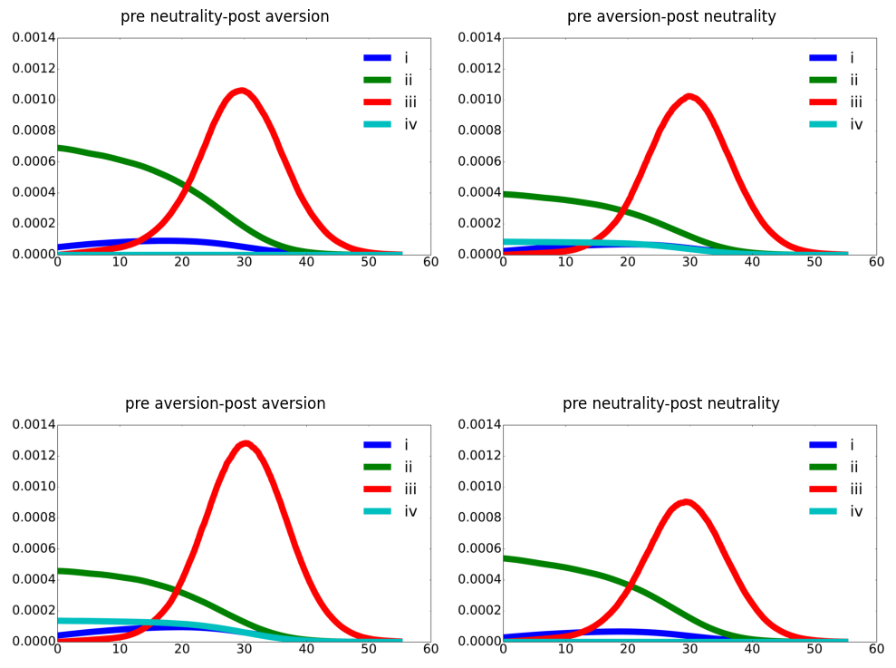

4: Value Decomposition
----------------------

4.1 Numerical Method Demonstration
----------------------------------

As we discussed in section 3, there are two steps to do value
decomposition:

1. `Simulate <https://github.com/korito1416/two-capital-climate-change/blob/main/python/FeymannKacs_simulate.py>`__
   state variable processes and first variation processes.

2. Calculated four terms of discounted social cash flow.

Here we use `finite difference
method <https://github.com/korito1416/two-capital-climate-change/blob/306b1c5ee51eb6ad24e6267fe0d2b82ad5286e98/python/FeymannKacs_simulate.py#L354>`__
to calculate the derivatives with respect to state variables and the
`interpolate <https://github.com/korito1416/two-capital-climate-change/blob/306b1c5ee51eb6ad24e6267fe0d2b82ad5286e98/python/FeymannKacs_simulate.py#L397>`__
to get partial derivatives at every point. The derivative we need to
calculate is

.. math::  \frac{\partial \mu_i}{\partial x}(x) ,    \frac{\partial \sigma_i}{\partial x}(x) , \frac{\partial V}{\partial x}(x)  ,V^\ell_x(X_t) , U_x(X_t) , {\mathcal J}^{\ell}_x(X_t)  

Then we start the for
`loop <https://github.com/korito1416/two-capital-climate-change/blob/306b1c5ee51eb6ad24e6267fe0d2b82ad5286e98/python/FeymannKacs_simulate.py#L727>`__
from time 0 to recursively get four discounted term.

We primarily use above code to get the value decomposition results. In
each iteraton step, we store calculate every term used in value
decomposition. Alternative way is to get the entire simulated state
variable and first variational path and then calculate remaining terms.
We can use our generalized code for state varibable and impulse response
simulation.

**The output variables are** In each simulated path, we can get state
variabls and controls with first variational process

.. math::

   \begin{align*}
      \{ \log K_t, Y_t,\log R_t ,\log N_t\},  \{i^k,i^r,\mathcal{E}_t\},\{M_t\},
   \end{align*}

and other variables that we use to do value decomposition.

.. math::

   \begin{align*}
     \{g^{\ell*}( x_{t}),g^{\ell'*}( x_{t})\},\{    \mathcal{J}^{\ell}(X_t) ,\mathcal{J}^{\ell'}(X_t) ,
       {\mathcal J}^{\ell'}_{\log R}(X_t)\}
   \end{align*}

4.2 Value Decomposition
-----------------------

We interpret the partial derivative of the value function with respect
to the R&D knowledge state as an asset price. As such, it has four
payoff contributions as we have derived previously:

1. :math:`\delta m \cdot \frac{\partial U}{\partial x}`;
2. :math:`m \cdot \sum_{\ell=1}^L \frac{\partial {\mathcal J}^\ell}{\partial x} g^{\ell*} (V^\ell - V)`;
3. :math:`m \cdot \sum_{\ell=1}^L {\mathcal J}^\ell g^{\ell*} \frac{\partial V^\ell}{\partial x}`;
4. :math:`\xi m \cdot \sum_{\ell=1}^L \frac{\partial {\mathcal J}^\ell}{\partial x} (1 - g^{\ell*} + g^{\ell*} \log g^{\ell*})`.

We also consider four different configurations of uncertainty aversion
as a way to assess the different economic forces in play:

1. pre-jump neutrality - post-jump neutrality;
2. pre-jump neutrality - post-jump aversion;
3. pre-jump aversion - post-jump neutrality;
4. pre-jump aversion - post-jump aversion.

We include cases b) and c) because they provide revealing intermediate
cases that help understand the overall uncertainty implications. For
instance, there are two forces in play. First, uncertainty about when
the new technology will be realized would seem to make investment in R&D
less attractive. Second, the positive implications for a technological
success can be stronger when there is more aversion to this uncertainty.
Intermediate case c) allows us to feature more the first force, while
intermediate case b) shifts attention to the second force. With these
intermediate cases, we can better assess the quantitative magnitude of
these offsetting forces.

R&D technology discovery channel with :math:`\xi = 0.15`
~~~~~~~~~~~~~~~~~~~~~~~~~~~~~~~~~~~~~~~~~~~~~~~~~~~~~~~~

+-------------------------+----+----+-------+-------+-----+-------+
| Case                    | i  | ii | ii    | ii    | iv  | sum   |
|                         |    |    | i(dc) | i(td) |     |       |
+=========================+====+====+=======+=======+=====+=======+
| pre neutrality          |    |    |       |       |     |       |
+-------------------------+----+----+-------+-------+-----+-------+
| a) post neutrality      | 0  | 0  | 0.    | 0.    | 0   | 0.    |
|                         | .0 | .0 | 01356 | 00173 | .00 | 03003 |
|                         | 01 | 12 |       |       | 000 |       |
|                         | 86 | 87 |       |       |     |       |
+-------------------------+----+----+-------+-------+-----+-------+
| b) post aversion        | 0  | 0  | 0.    | 0.    | 0   | 0.    |
|                         | .0 | .0 | 01570 | 00264 | .00 | 03705 |
|                         | 02 | 16 |       |       | 000 |       |
|                         | 61 | 10 |       |       |     |       |
+-------------------------+----+----+-------+-------+-----+-------+
| pre aversion            |    |    |       |       |     |       |
+-------------------------+----+----+-------+-------+-----+-------+
| c) post neutrality      | 0  | 0  | 0.    | 0.    | 0   | 0.    |
|                         | .0 | .0 | 01598 | 00124 | .00 | 03113 |
|                         | 01 | 09 |       |       | 241 |       |
|                         | 90 | 60 |       |       |     |       |
+-------------------------+----+----+-------+-------+-----+-------+
| d) post aversion        | 0  | 0  | 0.    | 0.    | 0   | 0.    |
|                         | .0 | .0 | 01999 | 00177 | .00 | 03962 |
|                         | 02 | 11 |       |       | 387 |       |
|                         | 72 | 04 |       |       |     |       |
+-------------------------+----+----+-------+-------+-----+-------+

R&D technology discovery channel with :math:`\xi = 0.075`
~~~~~~~~~~~~~~~~~~~~~~~~~~~~~~~~~~~~~~~~~~~~~~~~~~~~~~~~~

+---------------+-------+--------+--------+--------+--------+--------+
|               | i     | ii     | i      | i      | iv     | sum    |
|               |       |        | ii(dc) | ii(td) |        |        |
+===============+=======+========+========+========+========+========+
| **pre         |       |        |        |        |        |        |
| neutrality**  |       |        |        |        |        |        |
+---------------+-------+--------+--------+--------+--------+--------+
| a) post       | 0     | 0.012  | 0.013  | 0.001  | 0.000  | 0.     |
| neutrality    | .0018 | 873257 | 560828 | 734671 | 000004 | 030026 |
|               | 57218 |        |        |        |        |        |
+---------------+-------+--------+--------+--------+--------+--------+
| b) post       | 0     | 0.020  | 0.017  | 0.003  | 0.000  | 0.     |
| aversion      | .0035 | 756782 | 129194 | 902445 | 000012 | 045307 |
|               | 18361 |        |        |        |        |        |
+---------------+-------+--------+--------+--------+--------+--------+
| **pre         |       |        |        |        |        |        |
| aversion**    |       |        |        |        |        |        |
+---------------+-------+--------+--------+--------+--------+--------+
| c) post       | 0     | 0.006  | 0.018  | 0.000  | 0.004  | 0.     |
| neutrality    | .0019 | 724568 | 433624 | 809961 | 229411 | 032099 |
|               | 01772 |        |        |        |        |        |
+---------------+-------+--------+--------+--------+--------+--------+
| d) post       | 0     | 0.006  | 0.029  | 0.001  | 0.010  | 0.     |
| aversion      | .0033 | 335223 | 402412 | 150690 | 221146 | 050493 |
|               | 83954 |        |        |        |        |        |
+---------------+-------+--------+--------+--------+--------+--------+

### R&D technology discovery channel with :math:`\xi = 0.005`

+---------------+-------+--------+--------+--------+--------+--------+
|               | i     | ii     | i      | i      | iv     | sum    |
|               |       |        | ii(dc) | ii(td) |        |        |
+===============+=======+========+========+========+========+========+
| **pre         |       |        |        |        |        |        |
| neutrality**  |       |        |        |        |        |        |
+---------------+-------+--------+--------+--------+--------+--------+
| post          | 0     | 0.012  | 0.013  | 0.001  | 0.000  | 0.     |
| neutrality    | .0018 | 873257 | 560828 | 734671 | 000004 | 030026 |
|               | 57218 |        |        |        |        |        |
+---------------+-------+--------+--------+--------+--------+--------+
| post aversion | 0     | 0.071  | 0.001  | 0.022  | 0.000  | 0.     |
|               | .0096 | 895016 | 216563 | 364848 | 000171 | 105103 |
|               | 26521 |        |        |        |        |        |
+---------------+-------+--------+--------+--------+--------+--------+
| **pre         |       |        |        |        |        |        |
| aversion**    |       |        |        |        |        |        |
+---------------+-------+--------+--------+--------+--------+--------+
| post          | 0     | -0.000 | 0.023  | 0.000  | 0.001  | 0.     |
| neutrality    | .0013 | 342846 | 794618 | 000000 | 459983 | 026249 |
|               | 38064 |        |        |        |        |        |
+---------------+-------+--------+--------+--------+--------+--------+
| post aversion | -0    | -0.000 | 0.010  | 0.000  | 0.002  | 0.     |
|               | .0012 | 179618 | 892420 | 000000 | 009618 | 011436 |
|               | 85934 |        |        |        |        |        |
+---------------+-------+--------+--------+--------+--------+--------+

All four channels are activated with :math:`\xi = 0.15`
~~~~~~~~~~~~~~~~~~~~~~~~~~~~~~~~~~~~~~~~~~~~~~~~~~~~~~~

+---------------+-------+--------+--------+--------+--------+--------+
|               | i     | ii     | i      | i      | iv     | sum    |
|               |       |        | ii(dc) | ii(td) |        |        |
+===============+=======+========+========+========+========+========+
| **pre         |       |        |        |        |        |        |
| neutrality**  |       |        |        |        |        |        |
+---------------+-------+--------+--------+--------+--------+--------+
| a) post       | 0     | 0.012  | 0.013  | 0.001  | 0.000  | 0.     |
| neutrality    | .0018 | 873257 | 560828 | 734671 | 000004 | 030026 |
|               | 57218 |        |        |        |        |        |
+---------------+-------+--------+--------+--------+--------+--------+
| b) post       | 0     | 0.015  | 0.015  | 0.002  | 0.000  | 0.     |
| aversion      | .0025 | 145588 | 750393 | 774305 | 000007 | 036260 |
|               | 89657 |        |        |        |        |        |
+---------------+-------+--------+--------+--------+--------+--------+
| **pre         |       |        |        |        |        |        |
| aversion**    |       |        |        |        |        |        |
+---------------+-------+--------+--------+--------+--------+--------+
| c) post       | 0     | 0.009  | 0.016  | 0.001  | 0.002  | 0.     |
| neutrality    | .0020 | 885185 | 963779 | 264800 | 905626 | 033076 |
|               | 56726 |        |        |        |        |        |
+---------------+-------+--------+--------+--------+--------+--------+
| d) post       | 0     | 0.010  | 0.021  | 0.002  | 0.004  | 0.     |
| aversion      | .0030 | 126330 | 902142 | 065545 | 583659 | 041731 |
|               | 53070 |        |        |        |        |        |
+---------------+-------+--------+--------+--------+--------+--------+

4.3 Expected Marginal Social Payoffs for Alternative Horizons
-------------------------------------------------------------

As we demonstrated, the derivative of the value function has the
interpretation as a stochastically discounted social cash flow, with the
four contributions given at the outset of Section 3.3. The “stochastic
discount factor” includes the vector of stochastic impulse responses,
the process :math:`M`, along with the subjective rate of discount,
:math:`\delta`. The following figure shows the period-by-period
contribution for each of the four components.

Horizon decomposition of social cash flow contributions to the R&D stock
valuation. The four panels correspond to different uncertainty aversion
configurations: Panel A is the pre neutrality-post aversion
configuration; Panel B is the pre aversion-post neutrality
configuration; Panel C is the pre aversion-post aversion configuration;
and Panel D is the pre neutrality-post neutrality configuration. The
blue lines correspond to the payoff contribution i)
:math:`\delta m \cdot \frac{\partial U}{\partial r}`. The green lines
correspond to the payoff contribution ii)
:math:`m \cdot \sum_\ell g^{\ell*}\frac{\partial {\mathcal J}^\ell}{\partial r} (V^\ell - V)`.
The red lines correspond to the payoff contribution iii) $m
:raw-latex:`\cdot `:raw-latex:`\sum`\_:raw-latex:`\ell `g\ :sup:`{:raw-latex:`\ell*`}:raw-latex:`\mathcal `J`\ :raw-latex:`\ell `:raw-latex:`\frac{\partial V^\ell}{\partial r}`
$. The light blue lines correspond to the payoff contribution iv)
:math:`\xi m \cdot \sum_\ell \frac{\partial {\mathcal J}^\ell }{\partial r} (1-g^{\ell*} + g^{\ell*} \log g^{\ell*} )`.

.. code:: ipython3

    from pdf2image import convert_from_path
    import matplotlib.pyplot as plt
    
    # List of PDF paths
    pdf_files = [
        'additional/Aversion IntensityPre Neutrality Post Less AversionTechnology0.083_Discount_Term1234_dt2.pdf',
        'additional/Aversion IntensityPre Less Aversion Post NeutralityTechnology0.083_Discount_Term1234_dt2.pdf',
        'additional/Aversion IntensityPre Less Aversion Post Less AversionTechnology0.083_Discount_Term1234_dt2.pdf',
        'additional/Aversion IntensityPre Neutrality Post NeutralityTechnology0.083_Discount_Term1234_dt2.pdf'
    ]
    
    # Convert each PDF to image
    images = [convert_from_path(pdf, first_page=0, last_page=1)[0] for pdf in pdf_files]
    
    # Plot the images in a 2x2 grid using matplotlib
    fig, axs = plt.subplots(2, 2, figsize=(10, 10))
    
    # Display each image in the grid
    captions = [
        'pre neutrality-post aversion', 
        'pre aversion-post neutrality', 
        'pre aversion-post aversion', 
        'pre neutrality-post neutrality'
    ]
    
    for i, ax in enumerate(axs.flatten()):
        ax.imshow(images[i])
        ax.axis('off')  # Turn off axis
        ax.set_title(captions[i])
    
    # Adjust layout for spacing between images and titles
    plt.tight_layout()
    plt.show()

