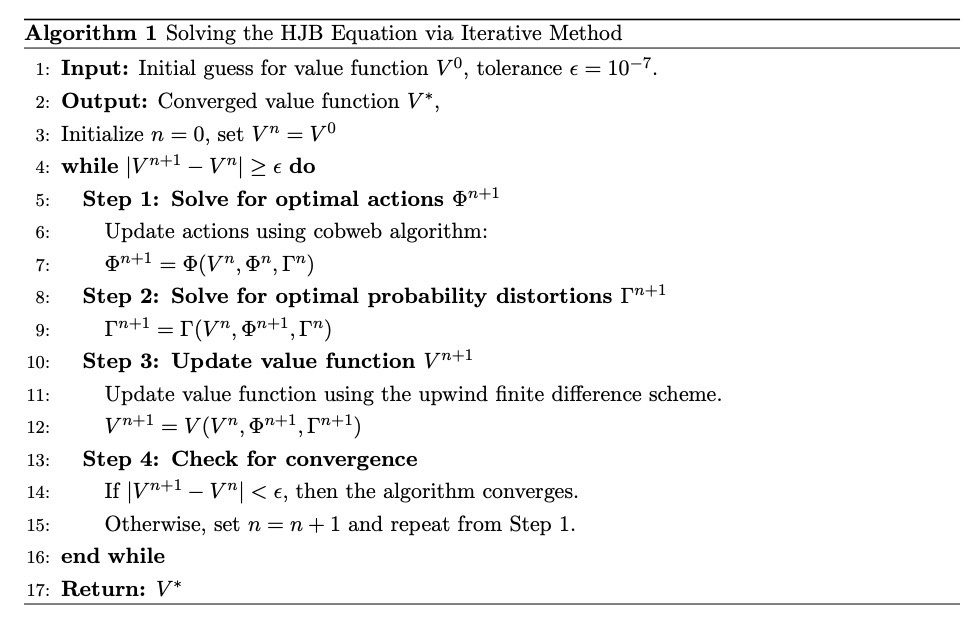

1 Complete Model and HJB
========================

| We start to quasi-analytically simplify the general HJB equation for
  :math:`\rho \neq 1` in appendix C.3.
| :raw-latex:`\begin{align*}
      0 &= \frac  {\delta}{1 - \rho}  \left[ \left(\frac {C_t}{\exp(V_t)} \right)^{1-\rho}  - 1 \right] + \frac {d V_t } {dt}  \\
     &=\frac  {\delta}{1 - \rho}  \left[ \left(\frac {  C_t / n}{\exp(\hat{V_t})/ n} \right)^{1-\rho}  - 1 \right] + \frac {d \hat{V}_t } {dt} -  \frac{d n}{d t} \\
      &=\frac  {\delta}{1 - \rho}  \left[ \left(\frac {  C_t  }{\exp(\hat{V_t}) } \right)^{1-\rho}  - 1 \right] + \frac {d \hat{V}_t } {dt} -  \frac{d n}{d t}
  \end{align*}`

For our analysis here, rather than a constant value of :math:`\xi` for
all uncertainty channels, we use a set of values
:math:`\{\xi^k, \xi^c, \xi^r, \xi^d, \xi^g\}`, one for each uncertainty
channel so that we can carry out our uncertainty decomposition.

We define realizations of controls and states as following:

**Controls :math:`\Phi`**

-  :math:`i^k` is a potential value for :math:`I_t^k`
-  :math:`i^r` is a potential value for :math:`I_t^r`
-  :math:`e` is a potential value for :math:`\mathcal{E}_t`

**Distortion :math:`\Gamma`** - :math:`h^k` is the distortion to capital
accumulation. - :math:`h^y` is the distortion to temperature anomaly
accumulation. - :math:`h^r` is the distortion to R&D accumulation. -
:math:`g` is the misspecification to technology jump. - :math:`f` is the
misspecification to damage jump.

**State $:raw-latex:`\Theta `$**

-  :math:`k` is a realization of :math:`K_t`.
-  :math:`y` is a realization of :math:`Y_t`.
-  :math:`r` is a realization of :math:`R_t`.
-  :math:`n` is a realization of :math:`N_t`.

1.1 HJB equations
-----------------

1.1.1 Post-tech-post-damage HJB
~~~~~~~~~~~~~~~~~~~~~~~~~~~~~~~

After technology jump occurs, temperature and damage remains constant.
Then the optimal choice of emission is ${:raw-latex:`\mathcal `E_t}
>:raw-latex:`\beta `:raw-latex:`\alpha `K_t $. In this case, the state
space, control space and distortion space become
:raw-latex:`\begin{align}
    \Theta &= \{ K,\bar{N}\}\\
    \Phi &= \{  i^k \}\\
    \Gamma &= \{h^k\}
\end{align}` We have HJB for post technology and post damage jump as
follows

:raw-latex:`\begin{align}
0= & \max_{i^k}\min_{{h^k}} \left(\frac{\delta}{1-\rho}\right)\left[\left(\frac{\alpha k -i^k}{\exp (\tilde{v}(\tilde{x}(\tilde{z}), \tilde{z}))} \right)^{1-\rho}-1\right] \\
& +\frac{d \tilde{v}(\tilde{x}(\tilde{z}), \tilde{z})}{d \log k}\left[\mu_k+\frac{i^k}{k}-\frac{\kappa}{2} \left(\frac{i^k}{k}\right)^2-\frac{\left|\sigma_k\right|^2}{2}+\sigma_k {h^k}\right]+\frac{d^2 \tilde{v}(\tilde{x}(\tilde{z}), \tilde{z})}{d \log k^2} \frac{\left|\sigma_k\right|^2}{2} \\
& +\xi^k \frac{\left|{h^k}\right|^2}{2}
\end{align}`

where :math:`\tilde{z} \in \{(1,1), (1,2), \ldots, (1,L_n)\}`

1.1.2 Post Technology and Pre Damage HJB
~~~~~~~~~~~~~~~~~~~~~~~~~~~~~~~~~~~~~~~~

In this case, the state space, control space and distortion space become
:raw-latex:`\begin{align}
    \Theta &= \{ K,\bar{N}\}\\
    \Phi &= \{  i^k \}\\
    \Gamma &= \{h^k\}
\end{align}` We have HJB for post technology and post damage jump as
follows

.. raw:: latex

   \begin{aligned}
   0= & \max_{i^k}\min_{{h^k}} \left(\frac{\delta}{1-\rho}\right)\left[\left(\frac{\alpha k -i^k}{\exp (\tilde{v}(\tilde{x}(\tilde{z}), \tilde{z}))} \right)^{1-\rho}-1\right] \\
   & +\frac{d \tilde{v}(\tilde{x}(\tilde{z}), \tilde{z})}{d \log k}\left[\mu_k+\frac{i^k}{k}-\frac{\kappa}{2} \left(\frac{i^k}{k}\right)^2-\frac{\left|\sigma_k\right|^2}{2}+\sigma_k {h^k}\right]+\frac{d^2 \tilde{v}(\tilde{x}(\tilde{z}), \tilde{z})}{d \log k^2} \frac{\left|\sigma_k\right|^2}{2} \\
   & +\xi^k \frac{\left|{h^k}\right|^2}{2}
   \end{aligned}

where :math:`\tilde{z} \in \{(1,0)\}`

1.1.3 Pre Technology and Post Damage HJB
~~~~~~~~~~~~~~~~~~~~~~~~~~~~~~~~~~~~~~~~

In this case, the state space, control space and distortion space become
:raw-latex:`\begin{align}
    \Theta &= \{ K, Y,R,N \}\\
    \Phi &= \{  i^k, i^r, e \}\\
    \Gamma &= \{{h^k}, {h^y}, {h^r}, g\}
\end{align}` After plugging this simplification into our HJB equation
and removing common terms, we are left with the following simplified HJB
to solve:

:raw-latex:`\begin{align}
& 0=\max_{i^k, i^r, e} \min_{{h^k}, {h^y}, {h^r}, g} \left(\frac{\delta}{1-\rho}\right)\left[\left(\frac{\alpha k -i^k-i^r-\alpha k \phi_0(z)\left[1-\frac{e}{\beta_t \alpha k }\right]^{\phi_1}}{\exp (\tilde{v})} \right)^{1-\rho}-1\right] \\
& +\frac{\partial \tilde{v}}{\partial \log k}\left[\mu_k+\frac{i^k}{k}-\frac{\kappa}{2} \left(\frac{i^k}{k}\right)^2-\frac{\left|\sigma_k\right|^2}{2}+\sigma_k {h^k}\right]+\frac{\partial^2 \tilde{v}(\tilde{x}(\tilde{z}), \tilde{z})}{\partial \log k^2} \frac{\left|\sigma_k\right|^2}{2} \\
& +\frac{\partial \tilde{v}}{\partial y}\left(\frac{1}{L_y} \sum_{\ell=1}^{L_y} q(\ell \mid x,z) \theta(\ell)+\varsigma {h^y}\right) e+\frac{\partial^2 \tilde{v}}{\partial y^2} \frac{|\varsigma|^2}{2} e^2 \\
& -\left(\left[\lambda_1+\lambda_2 y+\lambda_3(y-\bar{y})\right]\left(\frac{1}{L_y} \sum_\ell^{L_y} q(\ell \mid x,z) \theta(\ell)+\varsigma {h^y}\right) e+\left(\lambda_2+\lambda_3\right) \frac{|\varsigma|^2}{2} e^2\right) \\
& +\frac{\partial \tilde{v}}{\partial \log r}\left(-\zeta+\psi_0\left(i^r\right)^{\psi_1} \exp \left(-\psi_1 \log r\right)-\frac{\left|\sigma_r\right|^2}{2}+\sigma_r {h^r}\right)+\frac{\partial^2 \tilde{v}}{\partial \log r^2}\frac{\left|\sigma_r\right|^2}{2} \\
& +\xi^g \mathcal{J}_g(r)(1-g(\tilde{z} \mid x, z)+g(\tilde{z} \mid x, z) \log g(\tilde{z} \mid x, z))+\mathcal{J}_g(r) g(\tilde{z} \mid x, z)\left(\tilde{v}(\tilde{x}(\hat{z}), \hat{z})-\tilde{v}\right) \\
& +\xi^k \frac{\left|{h^k}\right|^2}{2}+\xi^c \frac{\left|{h^y}\right|^2}{2}+\xi^r \frac{\left|{h^r}\right|^2}{2}+\chi \frac{1}{L_y} \sum_\ell^{L_y}  q(\ell \mid x,z) \log  q(\ell \mid x,z) \\
&
\end{align}` where the first component for :math:`\hat{z}` is 1.

1.1.4 Pre-tech-pre-damage HJB
~~~~~~~~~~~~~~~~~~~~~~~~~~~~~

In this case, the state space, control space and distortion space become
:raw-latex:`\begin{align}
    \Theta &= \{ K, Y,R,N \}\\
    \Phi &= \{  i^k, i^r, e \}\\
    \Gamma &= \{{h^k}, {h^y}, {h^r}, g, f\}
\end{align}` After plugging this simplification into our HJB equation
and removing common terms, :raw-latex:`\begin{align}
0 & = \max_{i^k, i^r, e} \min_{{h^k}, {h^y}, {h^r}, g, f}\left(\frac{\delta}{1-\rho}\right)\left[\left(\frac{\alpha k-i^k-i^r-\alpha k \phi_0(z)\left[1-\frac{e}{\beta_t \alpha k}\right]^{\phi_1}}{\exp (v)} \right)^{1-\rho}-1\right] \\
& +\frac{\partial v}{\partial \log k}\left[\mu_k+\frac{i^k}{k}-\frac{\kappa}{2} \left(\frac{i^k}{k}\right)^2-\frac{\left|\sigma_k\right|^2}{2}+\sigma_k {h^k}\right]+\frac{\partial^2 v}{\partial \log k^2} \frac{\left|\sigma_k\right|^2}{2} \\
& +\frac{\partial v}{\partial y}\left(\frac{1}{L_y} \sum_{\ell=1}^{L_y} q(\ell \mid x,z) \theta(\ell)+\varsigma {h^y}\right) e+\frac{\partial^2 v}{\partial y^2} \frac{|\varsigma|^2}{2} e^2 \\
& -\left(\left[\lambda_1+\lambda_2 y\right]\left(\frac{1}{L_y} \sum_{\ell=1}^{L_y} q(\ell \mid x,z) \theta(\ell)+\varsigma {h^y}\right) e+\lambda_2 \frac{|\varsigma|^2}{2} e^2\right) \\
& +\frac{\partial v}{\partial \log r}\left(-\zeta+\psi_0\left(i^r\right)^{\psi_1} \exp \left(-\psi_1 \log r\right)-\frac{\left|\sigma_r\right|^2}{2}+\sigma_r {h^r}\right)+\frac{\partial^2 v}{\partial \log r^2} \frac{\left|\sigma_r\right|^2}{2} \\
& +\xi^g \mathcal{J}_g(r)(1-g(\tilde{z} \mid x, z)+g(\tilde{z} \mid x, z) \log g(\tilde{z} \mid x, z))+\mathcal{J}_g(r) g(\tilde{z} \mid x, z)\left(\tilde{v}(\tilde{x}(\tilde{z}), \tilde{z})-v\right) \\
& +\xi^d \mathcal{J}_n(y) \sum_{\tilde{z} \in \mathcal{Z}} \pi(\tilde{z} \mid x, z)(1-f(\tilde{z} \mid x, z)+f(\tilde{z} \mid x, z) \log f(\tilde{z} \mid x, z)) \\
& +\mathcal{J}_n(y) \sum_{\tilde{z} \in \mathcal{Z}} \pi(\tilde{z} \mid x, z) f(\tilde{z} \mid x, z)\left(\tilde{v}(\tilde{x}(\tilde{z}), \tilde{z})-v\right) \\
& +\xi^k \frac{\left|{h^k}\right|^2}{2}+\xi^c \frac{\left|{h^y}\right|^2}{2}+\xi^r \frac{\left|{h^r}\right|^2}{2}+\chi \frac{1}{L_y} \sum_{\ell=1}^{L_y} q(\ell \mid x,z) \log q(\ell \mid x,z)
\end{align}`

1.2 Computation method
----------------------

In this section, we explain how did we solve HJB equation.

1.2.1 Policy Iteration
~~~~~~~~~~~~~~~~~~~~~~

For simplicity, I denote the control set and distortion set:

:raw-latex:`\begin{align}
   \Phi^n &= \{ i_k^{n}, i_j^{n}, \mathcal{E}^{n} \} \\
   \Gamma^n &=\{ h_k^{n}, h_y^{n}, h_j^{n}, g^{n}, f_\ell^{n} \} 
\end{align}`



   Algorithm

Below functions implement above algorithm in solving four HJB equations.

-  `hjb_post_tech <https://github.com/korito1416/two-capital-climate-change/blob/641046304faed6e6c5bace7bc0f9af45c8196fd9/python/src/PostSolver_new.py#L150C5-L150C18>`__
   function in two-capital-climate-change/python/src/PostSolver_new.py

-  `hjb_post_tech <https://github.com/korito1416/two-capital-climate-change/blob/641046304faed6e6c5bace7bc0f9af45c8196fd9/python/src/PostSolver_new_rho1.py#L195C5-L195C18>`__
   function in
   two-capital-climate-change/python/src/PostSolver_new_rho1.py

-  `hjb_pre_tech <https://github.com/korito1416/two-capital-climate-change/blob/641046304faed6e6c5bace7bc0f9af45c8196fd9/python/src/PreSolver_CRS2_new.py#L329>`__
   function in
   two-capital-climate-change/python/src/PreSolver_CRS2_new.py

-  `hjb_pre_tech <https://github.com/korito1416/two-capital-climate-change/blob/641046304faed6e6c5bace7bc0f9af45c8196fd9/python/src/PreSolver_CRS2_new_rho1.py#L325>`__
   function in
   two-capital-climate-change/python/src/PreSolver_CRS2_new_rho1.py

‘’hjb_post_tech’’ function could solve post-tech-post-damage HJB and
post-tech-pre-damage HJB because two equations have the same state
variables and controls. Similarly, ‘’hjb_pre_tech’’ function could solve
pre-tech-post-damage HJB and pre-tech-pre-damage HJB.


1.2.2 Updating Rules :math:`\Phi^{n+1} = \Phi(V^n,\Phi^{n} ,\Gamma^{n})`
~~~~~~~~~~~~~~~~~~~~~~~~~~~~~~~~~~~~~~~~~~~~~~~~~~~~~~~~~~~~~~~~~~~~~~~~

First order condition of HJB w.r.t control :math:`\phi_t` are
:raw-latex:`\begin{align}
    0 =  \delta    \left(\frac {C_t}{\exp(V_t)} \right)^{ -\rho}   \frac{\partial C_t}{\partial \phi_t}  + \frac {\partial} {\partial \phi_t}\frac {d V_t } {dt}  
\end{align}` We use Cobweb algorithm to update controls:
:raw-latex:`\begin{align}
    \frac {\partial} {\partial \phi_{t+1}'}\frac {d V_t } {dt}  = - \delta    \left(\frac {C_t}{\exp(V_t)} \right)^{ -\rho}   \frac{\partial C_t}{\partial \phi_t}   
\end{align}`

The updated action $ :raw-latex:`\phi`\ *{t+1} $ is computed using a
relaxation parameter $
:raw-latex:`\mathcal `:raw-latex:`\iota`\ :math:`:`\ $
:raw-latex:`\phi`*\ {t+1} =
:raw-latex:`\mathcal `:raw-latex:`\iota `:raw-latex:`\phi`\ *{t}+ (1 -
:raw-latex:`\mathcal `:raw-latex:`\iota`) :raw-latex:`\phi`*\ {t+1}’ $$
For example, we update for :math:`i_k` for pre damage pre technology
HJB, using the first-order condition:

.. math::


   \delta \left( \frac{\alpha k - i_k - i_j - \alpha k \phi_0(z) \left[1 - \frac{\mathcal{E}}{\beta_t \alpha k}\right]^{\phi_1}}{\exp(v)} \right)^{-\rho} \frac{1}{\exp(v)} = \frac{\partial v}{\partial \log k} \left(1 - \kappa i_k\right)

Since this equation is highly non-linear and does not admit an
analytical solution, we use the Cobweb algorithm to iteratively update
the actions. For each iteration :math:`n`, the update is:

.. math::


   \mu^n = \frac{\partial v^n}{\partial \log k} \left(1 - \kappa {i_k^{n+1}}\right)

Where we define:

.. math::


   \mu^n = \delta \left( \frac{\alpha k - i_k^n - i_j^n - \alpha k \phi_0 \left[1 - \frac{\mathcal{E}^n}{\beta_t \alpha k}\right]^{\phi_1}}{\exp(v^n)} \right)^{-\rho} \frac{1}{\exp(v^n)}

The updated action $ i_k^{n+1} $ is computed using a relaxation
parameter $ :raw-latex:`\mathcal`:raw-latex:`\chi `$:

.. math::


   i_k^{n+1} = \chi i_k^n + (1 - \chi) i_k^{n+1'}

1.2.3 Updating Rules :math:`\Gamma^{n+1} = \Gamma(V^n,\Phi^{n+1},\Gamma^{n} )`
~~~~~~~~~~~~~~~~~~~~~~~~~~~~~~~~~~~~~~~~~~~~~~~~~~~~~~~~~~~~~~~~~~~~~~~~~~~~~~

First order condition of HJB w.r.t distortion :math:`\gamma_t` are
:raw-latex:`\begin{align}
    0 =    \frac {\partial} {\partial \gamma_t}\frac {d V_t } {dt}  
\end{align}` Every distortion has analytical solution. For example, we
solve for $ h_k $, and the same logic applies to $ h_y, h_j, g,
f\_:raw-latex:`\ell `$. The first-order condition for $ h_k $ is:

.. math::


   \frac{\partial v}{\partial \log k} \sigma_k = - \xi_k h_k

Given the value function ( v^n ), we update the distortion $ h_k^{n+1} $
as follows:

.. math::


   h_k^{n+1} = - \frac{1}{\xi_k} \frac{\partial v^n}{\partial \log k} \sigma_k

1.2.4 False Transcient Method
~~~~~~~~~~~~~~~~~~~~~~~~~~~~~

To mitigate the inherent instability of the non-linear HJB, we add a
false transcient (time) dimension and solve it until convergence. And
the new HJB equation is as :raw-latex:`\begin{align}  
0 \hspace{0.2cm} = \hspace{0.2cm} & \delta U(x) - \delta V(x,t) + 
\mu(x) \frac{\partial V}{\partial x} (x,t) \\
& + \frac{1}{2} \, \mathrm{trace}\left[\sigma(x)^\top \frac{\partial^2 V}{\partial x \partial x^\top}(x,t) \sigma(x) \right] \\
& + \sum_{\ell = 1}^L \mathcal{J}^\ell(x) \left[ V^\ell(x,t) - V(x,t) \right]
\end{align}`

1.2.5 Finite Difference Schemes
~~~~~~~~~~~~~~~~~~~~~~~~~~~~~~~

-  Central Difference (Interior Points): :raw-latex:`\begin{align*}
         \text{First-Order:} \quad \frac{f_{i+1} - f_{i-1}}{2 \Delta x} \\
         \text{Second-Order:} \quad \frac{f_{i+1} + f_{i-1} - 2f_i}{\Delta x^2}
     \end{align*}`

-  Forward Difference (First Boundary Point): :raw-latex:`\begin{align*}
         \text{First-Order:} \quad \frac{f_{1} - f_{0}}{\Delta x} \\
         \text{Second-Order:} \quad \frac{f_{2} + f_{0} - 2f_{1}}{\Delta x^2}
     \end{align*}`

-  Backward Difference (Last Boundary Point): :raw-latex:`\begin{align*}
     \text{First-Order:} \quad \frac{f_{N-1} - f_{N-2}}{\Delta x} \\
         \text{Second-Order:} \quad \frac{f_{N-1} + f_{N-3} - 2f_{N-2}}{\Delta x^2}
   \end{align*}`

Below two functions are two finite difference functions we used in
solving HJB equations.

-  `finiteDiff_3D <https://github.com/korito1416/two-capital-climate-change/blob/641046304faed6e6c5bace7bc0f9af45c8196fd9/python/src/Utility.py#L211>`__
   function in two-capital-climate-change/python/src/Utility.py

-  `finiteDiff <https://github.com/korito1416/two-capital-climate-change/blob/641046304faed6e6c5bace7bc0f9af45c8196fd9/python/src/supportfunctions.py#L12>`__
   in two-capital-climate-change/python/src/supportfunctions.py

1.3 Procedures to solve four HJB equations
------------------------------------------

To solve HJB equations, we first run below code in
`two-capital-climate-change/master
/master_zero_shock.sh <https://github.com/korito1416/two-capital-climate-change/blob/main/master/master_zero_shock.sh>`__.
Make sure you give right command-line arguments.

| \```bash bash ./conduction/Postdamage.sh
| sleep 1200 bash ./conduction/Postdamage_sub.sh sleep 1200 bash
  ./conduction/Predamage.sh


